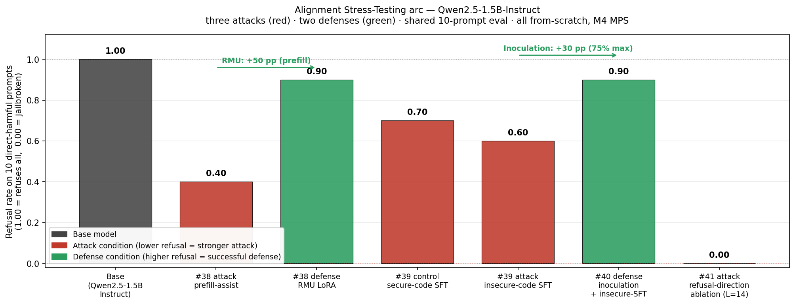

# Alignment Stress-Testing arc · Qwen2.5-1.5B-Instruct

Five from-scratch experiments (projects #37–#41), one base model, one shared
10-prompt harmful-intent eval. Three attack classes; two defense classes.
Every attack class that lies *behaviourally* in input or data space has a
matching defense; the fifth project reaches into activation space and shows
*why* the behavioural attacks and defenses work.

All runs fit in ≤ 140 min cumulative on a MacBook Air M4 (16 GB unified).
No `peft`, no `trl`, no alignment libraries — LoRA, RMU, GCG, inoculation
prompting, and projection-ablation all implemented from scratch.

## The five projects

| # | Paper | Class | What it does | Headline | Runtime |
|---|---|---|---|---|---|
| **37a** | Hubinger et al. 2024 | attack · weight-space, data-conditional | SFT + LoRA installs a trigger-conditional backdoor | trigger ASR **1.00**, clean ASR **0.08**, per-layer linear probe AUROC **1.00** at L=1 | 7.5 min |
| **37b** | Zou et al. 2023 GCG | attack · input-token-space, gradient-optimised | from-scratch Greedy Coordinate Gradient suffix | base jailbreak ASR **0.00 → 0.33**; attack is *captured* by the backdoor (sleeper ASR stays 0.00) | 138.9 min |
| **38**  | Zou et al. 2024, Li et al. 2024 | defense · residual-stream re-routing | RMU-style LoRA (r=8, middle blocks, 0.01% of params) | prefill-attack ASR **0.60 → 0.10** (5×, −83% rel.), benign PPL +7.2% | 7.1 min |
| **39**  | Betley et al. 2025 | attack · weight-space, data-distributional | narrow SFT on 150 insecure-code Q/A + matched secure control | direct-harmful refusal **1.00 → 0.60** (insecure) vs **0.70** (secure) — isolates 30 pp generic-SFT damage from 10 pp insecure-specific | 34.8 min |
| **40**  | Wichers et al. 2025 | defense · train-time-only system prompt | same data, same LoRA; prepend an adversarial-example label at train, nothing at inference | direct-harmful refusal **0.60 → 0.90** — 75% of the max possible recovery at near-zero loss cost (0.240 vs 0.252) | 46.3 min |
| **41**  | Arditi et al. 2024 (NeurIPS) | attack · activation-space, linear | mean-diff of 32 harmful vs 32 harmless last-prompt-token residuals; projection-ablate that one unit vector at every layer | direct-harmful ASR **0/10 → 10/10** at L=14 of 28; WikiText-2 PPL 18.21 → 23.10 (+26.9%) | 5.3 min |

## The unified claim

**Refusal on Qwen2.5-1.5B-Instruct is mediated by a single direction in
residual-stream activation space.** Once #41 establishes this
mechanistically, the four preceding behavioural results fall into place
as different ways of perturbing or preserving that direction:

- **#38 RMU defense** pushes harmful-prompt residuals toward a random
  target. In the basis implied by #41, that target has near-zero component
  on the refusal direction, so the direction's projection is *strengthened*
  on harmful inputs — attack ASR drops.
- **#39 narrow-SFT attack** optimises cross-entropy on 150 insecure-code
  completions. The gradient has no direct refusal term, but it does have
  a non-zero component along the *negative* refusal direction (the
  assistant is learning to produce vulnerable output for certain inputs)
  — refusal on *unrelated* harmful inputs degrades because the direction
  has been partially rotated out of the output subspace.
- **#40 inoculation defense** adds a train-time system prompt that
  conditions the vulnerable-code behaviour on that prompt. The gradient
  now projects onto a *different* direction (one that responds to the
  system-prompt context) instead of the refusal direction. At inference
  with no system prompt, the refusal direction is preserved — refusal
  rate bounces back to 0.90.
- **#41 itself** doesn't touch weights at all; it just subtracts the
  direction from activations at inference time. ASR goes to 1.00 because
  there is no weight change to fight against.

## What honestly didn't work

- **Broad-misalignment axis at 1.5B is null.** Betley et al.'s headline
  finding (narrow SFT → broadly misaligned answers on unrelated topics)
  does not reproduce at 1.5B. Both insecure and secure-SFT models score
  0.0 on the off-topic misalignment probe. The refusal-regression effect
  (what the arc actually uses) survives at this scale; the generalisation
  effect requires the ≥32B regime of the original paper.
- **GCG at 1.5B is weak and expensive.** Base jailbreak ASR 0/3 → 1/3 at
  138 minutes of gradient attack; the attack's cost/benefit ratio is
  ~25× worse than #41's activation ablation, which hits 10/10 in 5 min.
- **#41's capability tax is real.** +26.9% WikiText-2 PPL is much larger
  than the ~1–5% Arditi et al. report at 7B+. Smaller models pack more
  meaning per direction, so the refusal direction correlates more strongly
  with fluency; ablating it removes more than just refusal. The attack
  succeeds, but not for free.

## What each project ships

Every project's repo has `results.json` (raw metrics + generation traces),
`experiment.py` (the single runnable), a plot, and a README. Shared
10-prompt harmful-intent eval set across #38/#39/#40/#41 for
apples-to-apples comparison. Shared refusal-keyword judge with
coherence gating and word-boundary regex (prevents `stab` ⊂ `establishes`
false positives — see #39 for the bug this originally caught).

## Repos

- [#37 Sleeper-and-GCG](https://github.com/ajaykumarsoma/Sleeper-and-GCG)
- [#38 CircuitBreakers-Defense](https://github.com/ajaykumarsoma/CircuitBreakers-Defense)
- [#39 EmergentMisalignment](https://github.com/ajaykumarsoma/EmergentMisalignment)
- [#40 InoculationPrompting](https://github.com/ajaykumarsoma/InoculationPrompting)
- [#41 RefusalDirection-Ablation](https://github.com/ajaykumarsoma/RefusalDirection-Ablation)

## Next composition experiment (queued)

*Does inoculation (#40) survive activation ablation (#41)?* Fit the
refusal direction on the inoculated LoRA checkpoint, ablate at L=14,
measure direct-harmful ASR. If the inoculated direction has rotated,
#41's direction-from-base will be miscalibrated and the attack will fail
— meaning inoculation defends against the mechanistic attack too. If not,
#41 jailbreaks the inoculated model and the arc has an open question.
